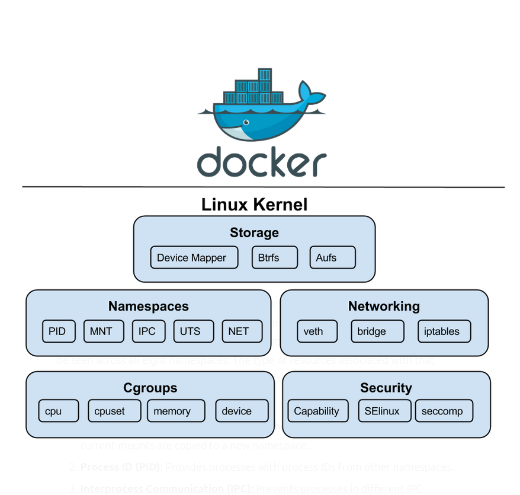
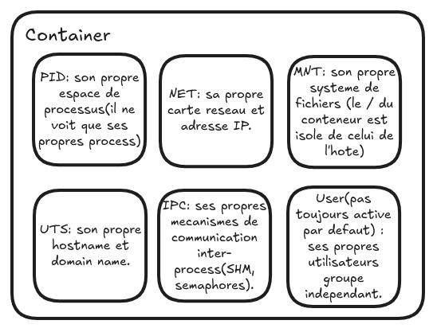

# Namespaces

Les namespaces sont l'une des principales caractéristiques du noyau Linux.

Ils permettent d'isoler les ressources du noyau.

Ils garantissent qu'un processus ne verra qu'un ensemble spécifié de ressources.

Parmi ces ressources, on trouve les IDs des processus, les noms d'hôte (hostnames), les fichiers, les noms d'utilisateur, les accès réseau et les communications inter-processus.

Le terme "namespace" fait référence à un type particulier d'isolation ainsi qu'à l'espace de noms associé.

Chaque processus individuel ne peut voir ou utiliser que le namespace auquel il est associé.

Ce type de fonctionnalité entre processus et namespace peut être observé à travers les 8 namespaces différents.

En voici quelques-uns :

1. **Mount (MNT)** : Contrôle les points de montage. Lorsqu’un nouvel espace de noms est créé, les points de montage actuels sont copiés dans ce nouvel espace de noms.

2. **Process ID (PID)** : Fournit aux processus des identifiants de processus (PID) distincts pour chaque namespace.

3. **Interprocess Communication (IPC)** : Empêche les processus appartenant à des espaces de noms différents de partager des mécanismes de communication interprocessus (comme la mémoire partagée SHM).

4. **Network (NET)** : Virtualise la pile réseau.

5. **Unix Time Sharing (UTS)** : Permet à un système d'avoir différents noms d'hôte et de domaine pour différents processus.

### Euh... Mais encore ?

Un namespace sous Linux, c'est comme une boîte fermée où l'on a rangé un aspect du système (processus, réseau, fichiers, etc.).

Chaque boîte est isolée des autres, donc ce qu'il y a dedans ne peut pas "voir" ce qu'il y a dans les autres.

#### En pratique

Un namespace est donc un mécanisme d'isolation fourni par Linux qui donne à un processus l'illusion qu'il est seul à utiliser une ressource alors qu'en réalité il partage le noyau avec d'autres.

Autrement dit, un namespace appliqué à un ou plusieurs processus va agir comme une loupe déformante qui va changer leur vision du système.

Par exemple, un conteneur (qui est un processus unique dans la machine hôte) n'est pas associé à un seul namespace mais à plusieurs en même temps.

